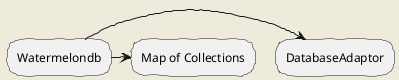

Architecture

```plantuml
@startuml
hide footbox
skinparam backgroundColor #EEEBDC
skinparam handwritten true
skinparam roundcorner 20
skinparam sequence {
  ActorBorderColor DeepSkyBlue
  ActorFontColor #A9DCDF
}
Watermelondb -> DatabaseAdaptor
Watermelondb -> Map of Collections
@enduml
```

* SqliteAdapter
* LokiJsAdapter
* model
* schema

